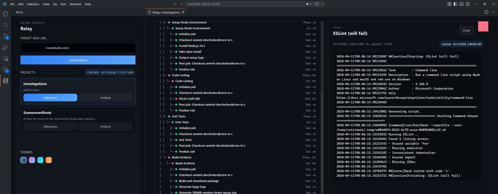

# Azure DevOps Relay

An Azure DevOps interface that allows easy access to build artifacts and task details.

## Demo

Video Link:

https://github.com/user-attachments/assets/6ae4ba7d-af43-40e9-b1f7-e1ae80c4af1a

## What It Does

- Loads Azure DevOps projects from a target organization URL
- Browses build definitions and recent builds
- Opens build details, timeline records, and task logs
- Downloads large logs idempotently instead of forcing inline loads. If you click a task, don't worry about the "oh crap now my vscode will crash."
- Downloads build artifacts to a local folder
- Caches data locally for faster repeat access, allows easy cache popping at will

## UI Flow

0. Install `semick-dev.ado-relay`.
1. Set environment variable `ADO_TOKEN` to ADO pat with at least `Build:Read` before starting `code`.
2. Open the Azure DevOps Relay activity bar view.
3. Enter the target Azure DevOps organization URL and load projects.
4. Choose a project and open its definitions or artifacts view.
5. Select a definition to inspect recent builds.
6. Open a build to inspect timeline steps, task logs, and artifacts.

## Notes

- `ADO_TOKEN` must be present in the VS Code environment for Azure DevOps requests to succeed.
- Large task logs are gated behind an idempotent download action. Repated clicks will simply load previous download.
- Contributor and local debugging instructions live in `CONTRIBUTING.md`.

## Data Storage

Azure DevOps Relay usually stores its local raw data under VS Code's extension `globalStorageUri`, rooted at:

- `.relay/cache/` for cached API responses
- `.relay/build/<buildId>/` for build-specific data such as timestamps, downloaded logs, timeline data, artifact metadata, and related cached files

The exact parent location depends on your VS Code platform/profile, but the extension-managed data is typically organized under a `.relay` folder inside the extension's global storage area.
